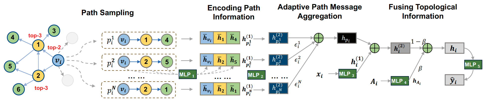
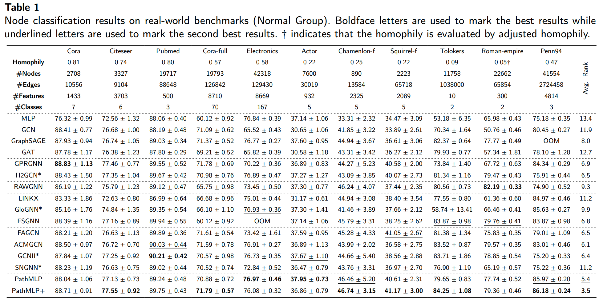
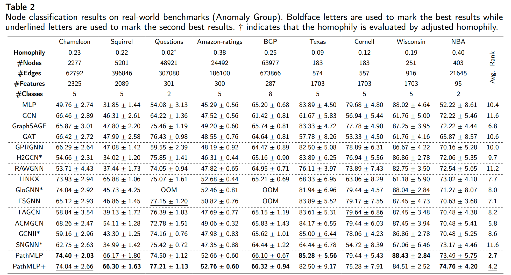

# PathMLP: Smooth Path Towards High-order Homophily
We propose a lightweight model based on multi-layer perceptrons (MLP), named PathMLP, which can encode messages carried by paths via simple transformation and concatenation operations, and effectively learn node representations in heterophilous graphs through adaptive path aggregation.

Paper：[PathMLP: Smooth path towards high-order homophily](https://www.sciencedirect.com/science/article/pii/S0893608024005744)

## 1 Model and Result







## 2 Environment

* torch                                     2.1.1+cu118
* torch-cluster                      1.6.3+pt21cu118
* torch-geometric                2.4.0
* torch-scatter                      2.1.2+pt21cu118
* torch-sparse                       0.6.18+pt21cu118
* torch-spline-conv             1.2.2+pt21cu118

## 3 Dataset

For most datasets, we use random splitting (48% / 32% / 20% for training / validation / testing) which is different from geom-gcn. For Tolokers, Questions, Roman-empire and Amazon-ratings, we use the splitting setting (50% / 25% / 25% for training / validation / testing) according to [34]. We evaluate all methods with 10 runs and report the average test accuracies (or AUC for Questions and Tolokers).

### 3.1 Normal Group

- Cora, Citeseer, Pubmed
- Cora-full
- Actor
- Chameleon-f, Squirrel-f
- Tolokers
- Roman-empire
- Penn94
- Electronics
### 3.2 Anomaly Group

- Chameleon, Squirrel
- Texas, Cornell, Wisconsin
- NBA
- Questions
- Amazon-ratings
- BGP

## 4 Run the codes

### 4.1 Project File Structure

* data  -- put data in this dir
* model -- PathMLP
* path  -- sampled path
* main.py  --  run this
* sampler.py  -- topk sampler
* utils.py  --  utils

### 4.2 Basic 

`python main.py --model "PathMLP" --dataset "cora" --beta 0.5 --depth 4 --path_num 10`

`python main.py --model "PathMLP+" --dataset "cora" --beta 0.5 --degree 2 --depth 4 --path_num 10`

### 4.3 Hyper-parameter Space

* depth  -- {3, 4, 5}
* path_num -- {2, 4, 6, 8, 10, 12, 15, 18}
* path_hidden -- {12, 24, 32}
* beta -- {0, 0.3, 0.5}
* degree -- {1, 2}

## 5 Citation

If you find our code and model useful, please cite our work. Thank you!

```
@article{zhou2024pathmlp,
  title={Pathmlp: smooth path towards high-order homophily},
  author={Zhou, Jiajun and Xie, Chenxuan and Gong, Shengbo and Qian, Jiaxu and Yu, Shanqing and Xuan, Qi and Yang, Xiaoniu},
  journal={Neural Networks},
  pages={106650},
  year={2024},
  publisher={Elsevier}
}
```

